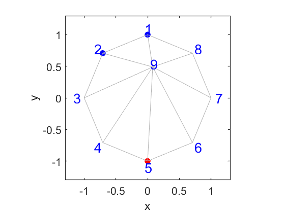
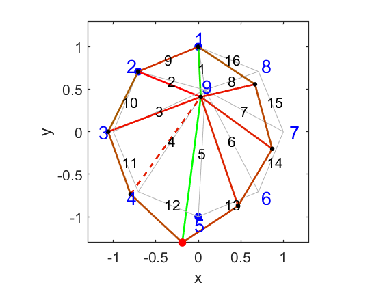
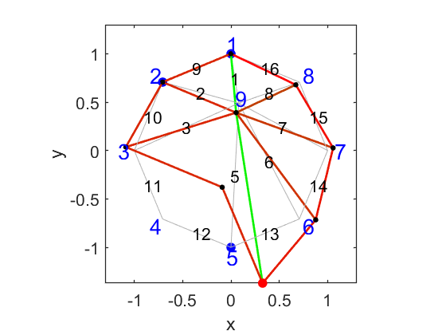

# 2D桁架结构的一个实例
如下图所示的桁架结构，其中1、2点与固定支架铰接，其他节点也都是通过铰接相连接，在图中的5点处施加一个竖直向下的力，看整个结构的变形情况。

 

<b>桁架结构</b>

 

如果在5点处施加一个1362N的力，得到的结果如下，绿色受拉，红色受压：

 

<b>变形情况</b>

 

由于此时4杆的压力超过了杆的压稳极限，因此将4杆去除，重新计算，得到的结果如下：

 

<b>变形情况</b>

 
